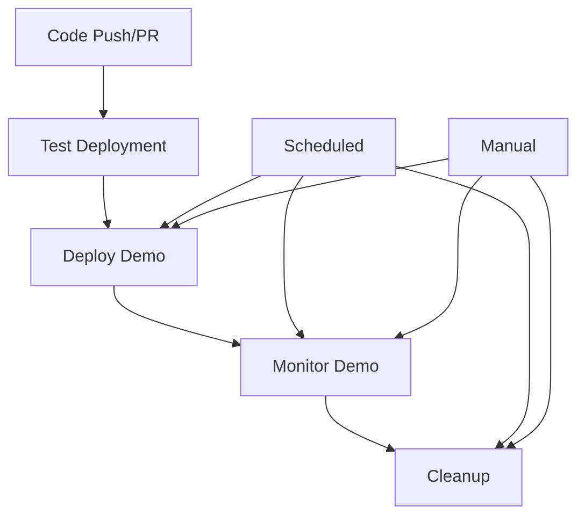

# SiriusScan Demo - GitHub Actions Workflows

This directory contains GitHub Actions workflows for automating the SiriusScan demo deployment, monitoring, and maintenance.

## Workflows Overview

### 1. Deploy Demo (`deploy-demo.yml`)

**Purpose**: Automatically deploy and rebuild the SiriusScan demo environment.

**Triggers**:

- **Scheduled**: Daily at 2:00 AM UTC
- **Manual**: Workflow dispatch with options
- **Push**: Changes to infrastructure, scripts, or data files
- **Pull Request**: Changes to deployment-related files

**Key Features**:

- OIDC authentication with AWS
- Terraform destroy → apply → validate cycle
- Health checks for API and UI services
- Data seeding automation
- Deployment summary generation
- PR comment integration

**Manual Options**:

- `skip_seeding`: Skip data seeding step
- `force_rebuild`: Force rebuild even if no changes detected

### 2. Cleanup (`cleanup.yml`)

**Purpose**: Automatically clean up old demo resources to manage costs.

**Triggers**:

- **Scheduled**: Every 6 hours
- **Manual**: Workflow dispatch with options

**Key Features**:

- Identifies and terminates old demo instances
- Cleans up orphaned security groups and IAM resources
- Keeps the most recent instance running
- Cost impact reporting

**Manual Options**:

- `force_cleanup`: Force cleanup even if resources are recent
- `cleanup_all`: Cleanup all demo resources (including current)

### 3. Test Deployment (`test-deployment.yml`)

**Purpose**: Validate deployment configuration without actually deploying.

**Triggers**:

- **Pull Request**: Changes to deployment-related files
- **Manual**: Workflow dispatch with test type selection

**Key Features**:

- Terraform format and validation checks
- Script syntax validation
- Required file verification
- Configuration summary generation
- PR comment integration

**Test Types**:

- `validation`: Full configuration validation
- `plan`: Terraform plan generation
- `dry-run`: Simulated deployment

### 4. Monitor Demo (`monitor-demo.yml`)

**Purpose**: Monitor the health and status of running demo instances.

**Triggers**:

- **Scheduled**: Every 2 hours
- **Manual**: Workflow dispatch with monitoring options

**Key Features**:

- Health checks for API and UI services
- Instance status monitoring
- Cost monitoring
- Automatic issue creation for health problems
- Monitoring report generation

**Manual Options**:

- `check_health`: Perform health checks
- `check_costs`: Check AWS costs
- `alert_threshold`: Alert threshold in minutes

## Setup Requirements

### AWS Configuration

1. **AWS Access Keys**: Create access keys for your AWS account
2. **Permissions**: Ensure keys have necessary permissions for demo deployment
3. **Secrets**: Add AWS credentials to repository secrets

### Required Permissions

The AWS access keys need permissions for:

- EC2 instance management
- Security group management
- IAM instance profile management
- CloudWatch logs (optional)
- Cost Explorer (optional, for cost monitoring)

### Repository Secrets

| Secret                  | Description               | Required                   |
| ----------------------- | ------------------------- | -------------------------- |
| `AWS_ACCESS_KEY_ID`     | AWS access key ID         | Yes                        |
| `AWS_SECRET_ACCESS_KEY` | AWS secret access key     | Yes                        |
| `AWS_REGION`            | AWS region for deployment | No (defaults to us-east-1) |

## Usage Examples

### Manual Deployment

```bash
# Trigger deployment via GitHub CLI
gh workflow run deploy-demo.yml

# Trigger with options
gh workflow run deploy-demo.yml -f skip_seeding=true
gh workflow run deploy-demo.yml -f force_rebuild=true
```

### Manual Cleanup

```bash
# Trigger cleanup via GitHub CLI
gh workflow run cleanup.yml

# Force cleanup all resources
gh workflow run cleanup.yml -f cleanup_all=true
```

### Manual Monitoring

```bash
# Trigger monitoring via GitHub CLI
gh workflow run monitor-demo.yml

# Monitor with custom threshold
gh workflow run monitor-demo.yml -f alert_threshold=60
```

## Workflow Dependencies



## Monitoring and Alerts

### Health Checks

- **API Health**: HTTP GET to `/health` endpoint
- **UI Health**: HTTP HEAD to UI endpoint
- **Instance Status**: AWS EC2 instance state
- **Uptime Tracking**: Instance launch time monitoring

### Automatic Alerts

- **Health Issues**: Creates GitHub issues for unhealthy environments
- **Cost Monitoring**: Tracks resource usage and costs
- **Cleanup Reports**: Documents cleanup actions and savings

### Artifacts

Each workflow generates artifacts:

- **Deployment Summary**: Instance details and access URLs
- **Cleanup Summary**: Resource cleanup results
- **Validation Summary**: Configuration validation results
- **Monitoring Report**: Health status and recommendations

## Troubleshooting

### Common Issues

1. **AWS Authentication Failures**

   - Verify AWS access key ID is correct
   - Check AWS secret access key is valid
   - Ensure access keys have proper permissions

2. **Terraform State Issues**

   - Check S3 backend configuration
   - Verify DynamoDB table exists
   - Ensure proper permissions

3. **Health Check Failures**

   - Check instance logs via SSM
   - Verify security group rules
   - Check service startup time

4. **Cleanup Issues**
   - Verify resource tagging
   - Check IAM permissions
   - Review cleanup logic

### Debug Commands

```bash
# Check workflow logs
gh run list --workflow=deploy-demo.yml
gh run view <run-id>

# Check instance status
aws ec2 describe-instances --filters "Name=tag:Project,Values=SiriusDemo"

# Access instance via SSM
aws ssm start-session --target <instance-id> --region us-east-1
```

## Cost Management

### Estimated Costs

- **t3.small Instance**: ~$15/month
- **EBS Storage**: ~$2.40/month
- **Data Transfer**: ~$1-5/month
- **Total**: ~$18-22/month per instance

### Cost Optimization

- **Automatic Cleanup**: Removes old instances
- **Scheduled Rebuilds**: Fresh instances daily
- **Resource Tagging**: Easy identification and cleanup
- **Monitoring**: Cost tracking and alerts

## Security Considerations

- **Access Key Management**: Store AWS credentials as GitHub secrets
- **Least Privilege**: Minimal required permissions for access keys
- **Resource Tagging**: Clear ownership and purpose
- **Audit Logging**: All actions logged in GitHub Actions

---

For more information, see the main project documentation in the root directory.
